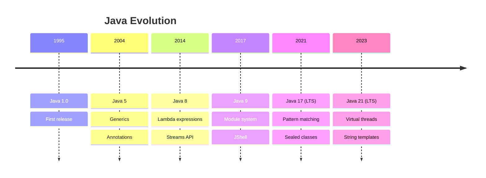

# JavaZone 2023 - Modern Java Features

## Virtual Threads (Project Loom)

Virtual threads are lightweight threads managed by the JVM rather than the operating system. This enables much higher concurrency for I/O-intensive applications.

```java
try (var executor = Executors.newVirtualThreadPerTaskExecutor()) {
    IntStream.range(0, 10_000).forEach(i -> {
        executor.submit(() -> {
            Thread.sleep(Duration.ofSeconds(1));
            return i;
        });
    });
}
```

### Benefits:
- **Scalability**: Handle millions of concurrent tasks
- **Simplicity**: Write code as if blocking, but with async performance  
- **Compatibility**: Works with existing Java APIs

## Pattern Matching

Pattern matching makes working with data more expressive and less error-prone.

```java
// Pattern matching with switch (Java 17+)
public String formatValue(Object obj) {
    return switch (obj) {
        case Integer i -> "int: " + i;
        case String s -> "string: " + s;
        case null -> "null value";
        default -> "unknown: " + obj.toString();
    };
}
```

## Record Classes

Records provide a compact way to declare classes that are transparent holders for shallowly immutable data.

```java
public record Person(String name, int age) {
    // Compact constructor
    public Person {
        if (age < 0) {
            throw new IllegalArgumentException("Age cannot be negative");
        }
    }
}
```

## Mermaid Diagram: Java Evolution Timeline



## Key Takeaways

1. **Virtual threads** will revolutionize concurrent programming in Java
2. **Pattern matching** makes code more readable and safer
3. **Records** reduce boilerplate for data classes
4. Java continues to evolve rapidly with regular releases

## Related Notes

See also:
- [[Spring Boot 3 Migration]]
- [[Microservices Architecture]]
- [[Performance Testing]]

## Resources

- [OpenJDK Project Loom](https://openjdk.org/projects/loom/)
- [Java 21 Documentation](https://docs.oracle.com/en/java/javase/21/)
- [JavaZone 2023 Videos](https://2023.javazone.no/)