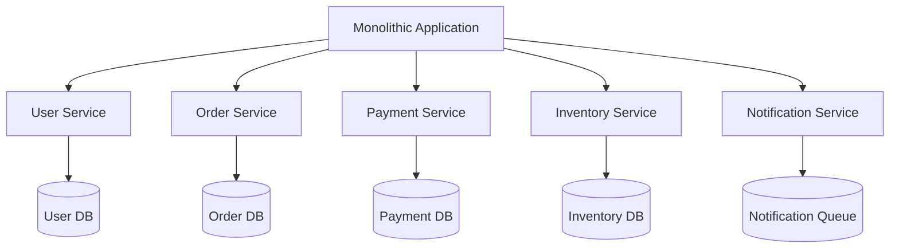

# Microservices Architecture

## Definition

Microservices is an architectural style that structures an application as a collection of loosely coupled, independently deployable services.

## Core Principles

### 1. Single Responsibility
Each service should have one business capability and do it well.

### 2. Autonomous Teams
Services should be owned by small, cross-functional teams.

### 3. Decentralized
- **Data Management**: Each service manages its own data
- **Governance**: Teams choose their own technology stack
- **Decision Making**: Autonomous service evolution

## Architecture Patterns

### Service Decomposition



### Communication Patterns

#### Synchronous Communication
```java
@RestController
public class OrderController {
    
    @Autowired
    private PaymentServiceClient paymentService;
    
    @PostMapping("/orders")
    public ResponseEntity<Order> createOrder(@RequestBody OrderRequest request) {
        // Process order
        Order order = orderService.createOrder(request);
        
        // Synchronous call to payment service
        PaymentResponse payment = paymentService.processPayment(
            order.getId(), 
            order.getAmount()
        );
        
        if (payment.isSuccessful()) {
            order.setStatus(OrderStatus.CONFIRMED);
        } else {
            order.setStatus(OrderStatus.PAYMENT_FAILED);
        }
        
        return ResponseEntity.ok(order);
    }
}
```

#### Asynchronous Communication (Event-Driven)
```java
@Service
public class OrderService {
    
    @Autowired
    private EventPublisher eventPublisher;
    
    public Order createOrder(OrderRequest request) {
        Order order = new Order(request);
        order = orderRepository.save(order);
        
        // Publish event asynchronously
        eventPublisher.publishEvent(new OrderCreatedEvent(
            order.getId(),
            order.getCustomerId(),
            order.getAmount()
        ));
        
        return order;
    }
}
```

## Best Practices

### 1. Database per Service

Each microservice should have its own database to ensure loose coupling.

**Good:**
```
User Service → User Database
Order Service → Order Database
Payment Service → Payment Database
```

**Avoid:**
```
User Service ↘
              → Shared Database
Order Service ↗
```

### 2. API Gateway Pattern

Centralize cross-cutting concerns like authentication, rate limiting, and routing.

```yaml
# API Gateway Configuration
spring:
  cloud:
    gateway:
      routes:
        - id: user-service
          uri: http://user-service:8080
          predicates:
            - Path=/api/users/**
          filters:
            - RewritePath=/api/users/(?<segment>.*), /${segment}
        
        - id: order-service
          uri: http://order-service:8080
          predicates:
            - Path=/api/orders/**
```

### 3. Circuit Breaker Pattern

Prevent cascading failures using circuit breakers.

```java
@Component
public class PaymentServiceClient {
    
    @CircuitBreaker(name = "payment-service", fallbackMethod = "fallbackPayment")
    @TimeLimiter(name = "payment-service")
    @Retry(name = "payment-service")
    public CompletableFuture<PaymentResponse> processPayment(Long orderId, BigDecimal amount) {
        return CompletableFuture.supplyAsync(() -> {
            // Call payment service
            return restTemplate.postForObject(
                "/payments", 
                new PaymentRequest(orderId, amount), 
                PaymentResponse.class
            );
        });
    }
    
    public CompletableFuture<PaymentResponse> fallbackPayment(Long orderId, BigDecimal amount, Exception ex) {
        return CompletableFuture.completedFuture(
            new PaymentResponse(orderId, PaymentStatus.PENDING, "Service temporarily unavailable")
        );
    }
}
```

## Deployment Strategies

### Container Orchestration

```yaml
# Kubernetes Deployment
apiVersion: apps/v1
kind: Deployment
metadata:
  name: user-service
spec:
  replicas: 3
  selector:
    matchLabels:
      app: user-service
  template:
    metadata:
      labels:
        app: user-service
    spec:
      containers:
      - name: user-service
        image: user-service:1.0.0
        ports:
        - containerPort: 8080
        env:
        - name: DB_HOST
          value: "user-db-service"
        - name: DB_PASSWORD
          valueFrom:
            secretKeyRef:
              name: user-db-secret
              key: password
```

## Monitoring & Observability

### Distributed Tracing

```java
@RestController
public class OrderController {
    
    @Autowired
    private Tracer tracer;
    
    @PostMapping("/orders")
    public ResponseEntity<Order> createOrder(@RequestBody OrderRequest request) {
        Span span = tracer.nextSpan()
            .name("create-order")
            .tag("customer.id", request.getCustomerId().toString())
            .start();
        
        try (Tracer.SpanInScope ws = tracer.withSpanInScope(span)) {
            Order order = orderService.createOrder(request);
            span.tag("order.id", order.getId().toString());
            return ResponseEntity.ok(order);
        } finally {
            span.end();
        }
    }
}
```

## Common Challenges

### 1. Data Consistency
- **Problem**: Distributed transactions across services
- **Solution**: Saga Pattern, Event Sourcing

### 2. Service Discovery
- **Problem**: Services need to find each other
- **Solution**: Service registry (Eureka, Consul)

### 3. Configuration Management
- **Problem**: Managing configuration across services
- **Solution**: Centralized configuration (Spring Cloud Config)

## Trade-offs

### Benefits
- **Scalability**: Scale services independently
- **Technology Diversity**: Choose best tool for each service
- **Team Autonomy**: Independent development and deployment
- **Fault Isolation**: Failures contained to individual services

### Drawbacks
- **Complexity**: Distributed system complexity
- **Network Latency**: Inter-service communication overhead  
- **Data Consistency**: Eventual consistency challenges
- **Testing**: Integration testing complexity

## When to Use Microservices

✅ **Good fit when:**
- Large, complex applications
- Multiple teams working on the same system
- Need for independent scaling
- Different technology requirements per service

❌ **Avoid when:**
- Small applications or teams
- Tight coupling between business capabilities
- No clear service boundaries
- Limited operational maturity

## Related Notes

- [[Spring Boot 3 Migration]]
- [[Kubernetes Deployment]]
- [[Event-Driven Architecture]]
- [[API Design Best Practices]]

## Resources

- [Microservices.io](https://microservices.io/)
- [Building Microservices by Sam Newman](https://www.oreilly.com/library/view/building-microservices/9781491950340/)
- [Spring Cloud Documentation](https://spring.io/projects/spring-cloud)