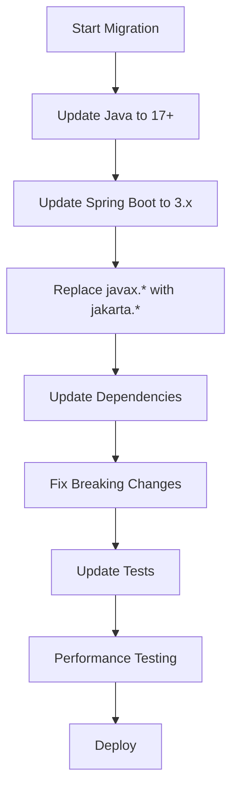

# Spring Boot 3 Migration

## Overview

Spring Boot 3.0 represents a major milestone with significant changes and improvements.

## Key Requirements

- **Java 17+**: Minimum Java version is now 17
- **Spring Framework 6**: Built on Spring Framework 6.0
- **Jakarta EE**: Migration from Java EE to Jakarta EE

## Breaking Changes

### Package Names

```java
// Before (Java EE)
import javax.servlet.http.HttpServletRequest;
import javax.persistence.Entity;

// After (Jakarta EE)  
import jakarta.servlet.http.HttpServletRequest;
import jakarta.persistence.Entity;
```

### Configuration Changes

```yaml
# Before
spring:
  jpa:
    hibernate:
      naming:
        physical-strategy: org.hibernate.boot.model.naming.PhysicalNamingStrategyStandardImpl

# After
spring:
  jpa:
    hibernate:
      naming:
        physical-strategy: org.hibernate.boot.model.naming.CamelCaseToUnderscoresNamingStrategy
```

## New Features

### Native Image Support

Spring Boot 3 includes first-class support for GraalVM native images:

```bash
# Build native image
./mvnw -Pnative native:compile

# Run native image
./target/myapp
```

### Observability Improvements

Enhanced observability with Micrometer and Micrometer Tracing:

```java
@RestController
public class UserController {
    
    @GetMapping("/users/{id}")
    @Timed(name = "user.get", description = "Time taken to get user")
    public User getUser(@PathVariable Long id) {
        return userService.findById(id);
    }
}
```

## Migration Process



## Common Issues & Solutions

### 1. Dependency Conflicts

**Problem**: Transitive dependencies using old Java EE APIs

**Solution**: 
```xml
<dependency>
    <groupId>org.springframework.boot</groupId>
    <artifactId>spring-boot-starter-web</artifactId>
    <exclusions>
        <exclusion>
            <groupId>org.apache.tomcat.embed</groupId>
            <artifactId>tomcat-embed-el</artifactId>
        </exclusion>
    </exclusions>
</dependency>
```

### 2. Security Configuration

**Before:**
```java
@EnableWebSecurity
public class SecurityConfig extends WebSecurityConfigurerAdapter {
    @Override
    protected void configure(HttpSecurity http) throws Exception {
        http.authorizeRequests()
            .antMatchers("/public/**").permitAll()
            .anyRequest().authenticated();
    }
}
```

**After:**
```java
@EnableWebSecurity
public class SecurityConfig {
    @Bean
    public SecurityFilterChain filterChain(HttpSecurity http) throws Exception {
        return http
            .authorizeHttpRequests(auth -> auth
                .requestMatchers("/public/**").permitAll()
                .anyRequest().authenticated()
            )
            .build();
    }
}
```

## Testing Strategy

1. **Unit Tests**: Update package imports
2. **Integration Tests**: Verify Jakarta EE compatibility
3. **Performance Tests**: Compare before/after metrics
4. **Native Image Tests**: Test GraalVM compilation

## Benefits

- **Performance**: Improved startup time and memory usage
- **Security**: Latest security patches and improvements  
- **Native Images**: Faster startup and lower memory footprint
- **Modern Java**: Leverage Java 17+ features

## Related Notes

- [[JavaZone 2023 - Modern Java Features]]
- [[Microservices Architecture]]
- [[GraalVM Native Images]]

## Resources

- [Spring Boot 3.0 Migration Guide](https://github.com/spring-projects/spring-boot/wiki/Spring-Boot-3.0-Migration-Guide)
- [Jakarta EE Migration](https://eclipse-ee4j.github.io/jakartaee-platform/)
- [GraalVM Native Image Guide](https://www.graalvm.org/latest/reference-manual/native-image/)